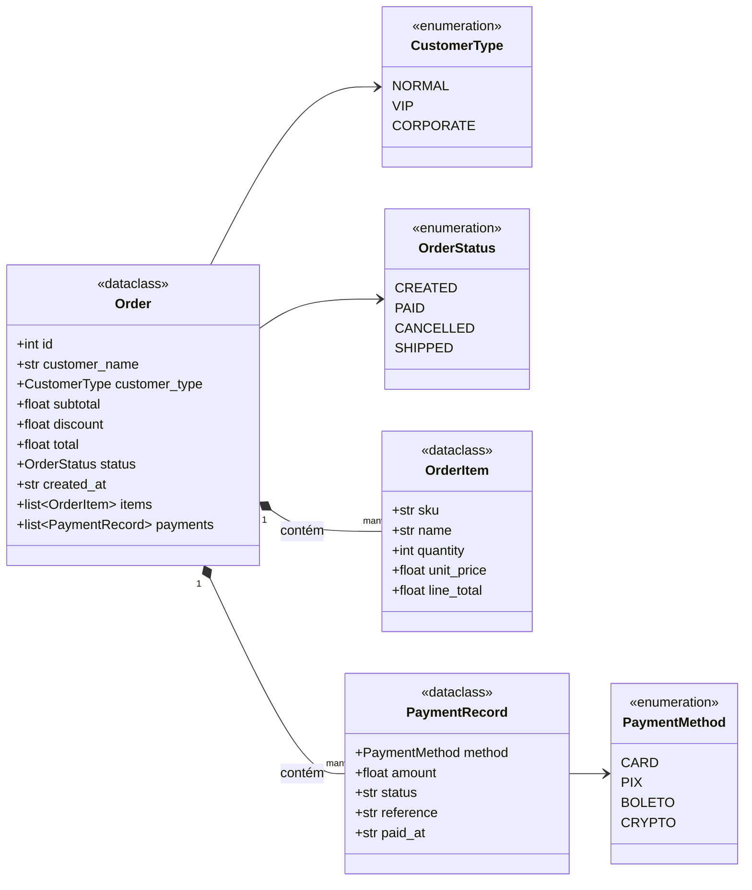
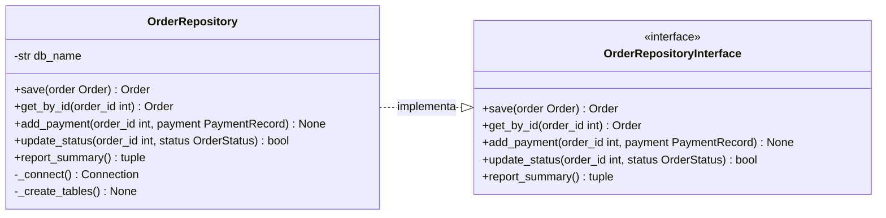
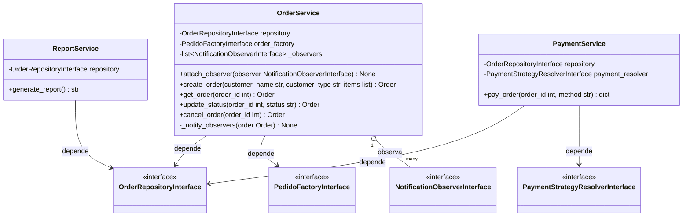
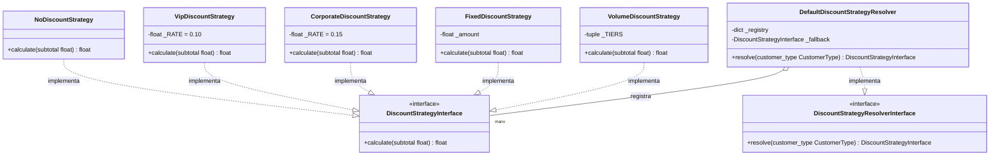
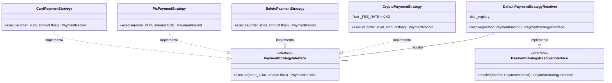
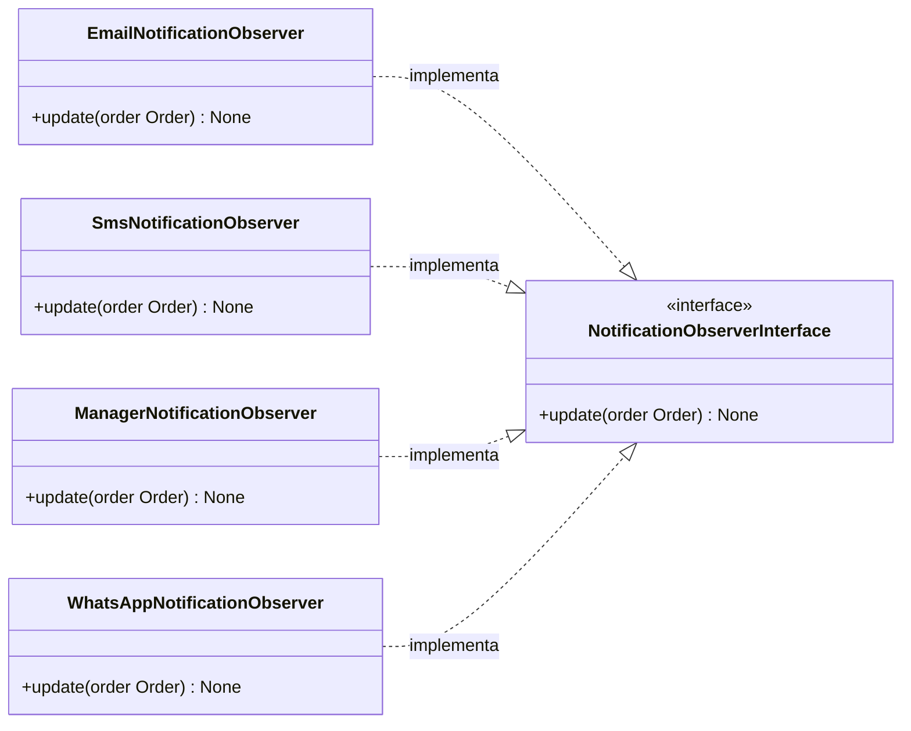
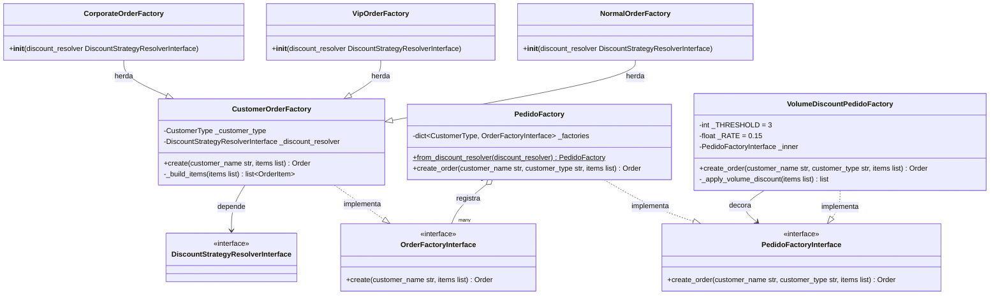

# Diagrama de Classes

Diagrama UML dividido por camada para facilitar leitura e exportação.

---

## 1. Modelos

---

## 2. Interfaces

```mermaid
classDiagram
    direction TB

    class OrderRepositoryInterface {
        <<interface>>
        +save(order Order) Order
        +get_by_id(order_id int) Order
        +add_payment(order_id int, payment PaymentRecord) None
        +update_status(order_id int, status OrderStatus) bool
        +report_summary() tuple
    }

    class NotificationObserverInterface {
        <<interface>>
        +update(order Order) None
    }

    class PaymentReferenceProviderInterface {
        <<interface>>
        +reference_for(method PaymentMethod, order_id int) str
    }

    class DiscountStrategyInterface {
        <<interface>>
        +calculate(subtotal float) float
    }

    class DiscountStrategyResolverInterface {
        <<interface>>
        +resolve(customer_type CustomerType) DiscountStrategyInterface
    }

    class PaymentStrategyInterface {
        <<interface>>
        +execute(order_id int, amount float) PaymentRecord
    }

    class PaymentStrategyResolverInterface {
        <<interface>>
        +resolve(method PaymentMethod) PaymentStrategyInterface
    }

    class OrderFactoryInterface {
        <<interface>>
        +create(customer_name str, items list) Order
    }

    class PedidoFactoryInterface {
        <<interface>>
        +create_order(customer_name str, customer_type str, items list) Order
    }

    DiscountStrategyResolverInterface --> DiscountStrategyInterface : retorna
    PaymentStrategyResolverInterface --> PaymentStrategyInterface : retorna
```

---

## 3. Repositório

---

## 4. Serviços

---

## 5. Estratégias de Desconto

---

## 6. Estratégias de Pagamento

---

## 7. Observadores

---

## 8. Fábricas

---

## Legenda

| Seta | Significado |
|------|-------------|
| `──▷` (sólida, triângulo vazio) | **Herança** — subclasse estende superclasse |
| `╌╌▷` (tracejada, triângulo vazio) | **Implementação** — classe implementa interface |
| `───>` (sólida, seta aberta) | **Dependência** — classe depende de abstração |
| `◆───` (losango preenchido) | **Composição** — dono controla ciclo de vida |
| `◇───` (losango vazio) | **Agregação** — referência sem controle de ciclo de vida |

## Padrões de Projeto

| Padrão | Classes envolvidas |
|--------|--------------------|
| **Strategy** | `DiscountStrategyInterface` + 5 implementações; `PaymentStrategyInterface` + 4 implementações |
| **Strategy Resolver** | `DefaultDiscountStrategyResolver`, `DefaultPaymentStrategyResolver` |
| **Factory Method** | `CustomerOrderFactory` → `NormalOrderFactory`, `VipOrderFactory`, `CorporateOrderFactory` |
| **Abstract Factory** | `PedidoFactory` coordena factories por `CustomerType` |
| **Decorator** | `VolumeDiscountPedidoFactory` envolve `PedidoFactoryInterface` |
| **Observer** | `OrderService` notifica `NotificationObserverInterface` + 4 observers |
| **Repository** | `OrderRepositoryInterface` + `OrderRepository` (SQLite) |
| **Dependency Injection** | Todos os services recebem dependências via construtor |
