# Diagrama de Classes

Diagrama UML (Mermaid) cobrindo todas as camadas do projeto: **models**, **interfaces**, **repositories**, **services**, **strategies**, **factories** e **observers**.

> Títulos e rótulos; nomes de classes e métodos idênticos ao código-fonte.

```mermaid
---
title: Diagrama de Classes - Sistema de Pedidos
---
classDiagram
    direction TB

    
    %% CAMADA / MODELOS
    

    class CustomerType {
        <<enumeration>>
        NORMAL
        VIP
        CORPORATE
    }

    class OrderStatus {
        <<enumeration>>
        CREATED
        PAID
        CANCELLED
        SHIPPED
    }

    class PaymentMethod {
        <<enumeration>>
        CARD
        PIX
        BOLETO
    }

    class OrderItem {
        <<dataclass>>
        +str sku
        +str name
        +int quantity
        +float unit_price
        +float line_total
    }

    class PaymentRecord {
        <<dataclass>>
        +PaymentMethod method
        +float amount
        +str status
        +str reference
        +str paid_at
    }

    class Order {
        <<dataclass>>
        +int id
        +str customer_name
        +CustomerType customer_type
        +float subtotal
        +float discount
        +float total
        +OrderStatus status
        +str created_at
        +list~OrderItem~ items
        +list~PaymentRecord~ payments
    }

    Order *-- OrderItem : contém
    Order *-- PaymentRecord : contém
    Order --> CustomerType : usa
    Order --> OrderStatus : usa
    PaymentRecord --> PaymentMethod : usa

    
    %% CAMADA / INTERFACES (ABSTRAÇÕES)
    

    class OrderRepositoryInterface {
        <<abstract>>
        +save(order: Order) Order
        +get_by_id(order_id: int) Order
        +add_payment(order_id: int, payment: PaymentRecord) None
        +update_status(order_id: int, status: OrderStatus) bool
        +report_summary() tuple
    }

    class NotificationObserverInterface {
        <<abstract>>
        +update(order: Order) None
    }

    class PaymentReferenceProviderInterface {
        <<abstract>>
        +reference_for(method: PaymentMethod, order_id: int) str
    }

    
    %% CAMADA / ESTRATÉGIAS DE DESCONTO
    

    class DiscountStrategyInterface {
        <<abstract>>
        +calculate(subtotal: float) float
    }

    class DiscountStrategyResolverInterface {
        <<abstract>>
        +resolve(customer_type: CustomerType) DiscountStrategyInterface
    }

    class NoDiscountStrategy {
        +calculate(subtotal: float) float
    }

    class VipDiscountStrategy {
        -float _RATE
        +calculate(subtotal: float) float
    }

    class CorporateDiscountStrategy {
        -float _RATE
        +calculate(subtotal: float) float
    }

    class FixedDiscountStrategy {
        -float _amount
        +calculate(subtotal: float) float
    }

    class VolumeDiscountStrategy {
        -tuple _TIERS
        +calculate(subtotal: float) float
    }

    class DefaultDiscountStrategyResolver {
        -dict _registry
        -DiscountStrategyInterface _fallback
        +resolve(customer_type: CustomerType) DiscountStrategyInterface
    }

    NoDiscountStrategy ..|> DiscountStrategyInterface : implementa
    VipDiscountStrategy ..|> DiscountStrategyInterface : implementa
    CorporateDiscountStrategy ..|> DiscountStrategyInterface : implementa
    FixedDiscountStrategy ..|> DiscountStrategyInterface : implementa
    VolumeDiscountStrategy ..|> DiscountStrategyInterface : implementa
    DefaultDiscountStrategyResolver ..|> DiscountStrategyResolverInterface : implementa
    DefaultDiscountStrategyResolver --> DiscountStrategyInterface : depende

    
    %% CAMADA / ESTRATÉGIAS DE PAGAMENTO
    

    class PaymentStrategyInterface {
        <<abstract>>
        +execute(order_id: int, amount: float) PaymentRecord
    }

    class PaymentStrategyResolverInterface {
        <<abstract>>
        +resolve(method: PaymentMethod) PaymentStrategyInterface
    }

    class CardPaymentStrategy {
        +execute(order_id: int, amount: float) PaymentRecord
    }

    class PixPaymentStrategy {
        +execute(order_id: int, amount: float) PaymentRecord
    }

    class BoletoPaymentStrategy {
        +execute(order_id: int, amount: float) PaymentRecord
    }

    class CryptoPaymentStrategy {
        -float _FEE_RATE
        +execute(order_id: int, amount: float) PaymentRecord
    }

    class DefaultPaymentStrategyResolver {
        -dict _registry
        +resolve(method: PaymentMethod) PaymentStrategyInterface
    }

    CardPaymentStrategy ..|> PaymentStrategyInterface : implementa
    PixPaymentStrategy ..|> PaymentStrategyInterface : implementa
    BoletoPaymentStrategy ..|> PaymentStrategyInterface : implementa
    CryptoPaymentStrategy ..|> PaymentStrategyInterface : implementa
    DefaultPaymentStrategyResolver ..|> PaymentStrategyResolverInterface : implementa
    DefaultPaymentStrategyResolver --> PaymentStrategyInterface : depende

    
    %% CAMADA / FÁBRICAS
        

    class OrderFactoryInterface {
        <<abstract>>
        +create(customer_name: str, items: OrderItemsInput) Order
    }

    class PedidoFactoryInterface {
        <<abstract>>
        +create_order(customer_name: str, customer_type: str, items: OrderItemsInput) Order
    }

    class CustomerOrderFactory {
        -CustomerType _customer_type
        -DiscountStrategyResolverInterface _discount_resolver
        +create(customer_name: str, items: OrderItemsInput) Order
    }

    class NormalOrderFactory {
    }

    class VipOrderFactory {
    }

    class CorporateOrderFactory {
    }

    class PedidoFactory {
        -dict _factories
        +from_discount_resolver(discount_resolver)$ PedidoFactory
        +create_order(customer_name: str, customer_type: str, items: OrderItemsInput) Order
    }

    CustomerOrderFactory ..|> OrderFactoryInterface : implementa
    NormalOrderFactory --|> CustomerOrderFactory : herda
    VipOrderFactory --|> CustomerOrderFactory : herda
    CorporateOrderFactory --|> CustomerOrderFactory : herda
    PedidoFactory ..|> PedidoFactoryInterface : implementa
    PedidoFactory --> OrderFactoryInterface : depende
    CustomerOrderFactory --> DiscountStrategyResolverInterface : depende

    
    %% CAMADA / REPOSITÓRIOS
    

    class OrderRepository {
        -str db_name
        +save(order: Order) Order
        +get_by_id(order_id: int) Order
        +add_payment(order_id: int, payment: PaymentRecord) None
        +update_status(order_id: int, status: OrderStatus) bool
        +report_summary() tuple
    }

    OrderRepository ..|> OrderRepositoryInterface : implementa

    
    %% CAMADA / OBSERVADORES
        

    class EmailNotificationObserver {
        +update(order: Order) None
    }

    class SmsNotificationObserver {
        +update(order: Order) None
    }

    class ManagerNotificationObserver {
        +update(order: Order) None
    }

    class WhatsAppNotificationObserver {
        +update(order: Order) None
    }

    EmailNotificationObserver ..|> NotificationObserverInterface : implementa
    SmsNotificationObserver ..|> NotificationObserverInterface : implementa
    ManagerNotificationObserver ..|> NotificationObserverInterface : implementa
    WhatsAppNotificationObserver ..|> NotificationObserverInterface : implementa

        
    %% CAMADA / SERVIÇOS
        

    class OrderService {
        -OrderRepositoryInterface repository
        -PedidoFactoryInterface order_factory
        -list~NotificationObserverInterface~ _observers
        +attach_observer(observer: NotificationObserverInterface) None
        +create_order(customer_name: str, customer_type: str, items: OrderItemsInput) Order
        +get_order(order_id: int) Order
        +update_status(order_id: int, status: str) Order
        +cancel_order(order_id: int) Order
    }

    class PaymentService {
        -OrderRepositoryInterface repository
        -PaymentStrategyResolverInterface payment_resolver
        +pay_order(order_id: int, method: str) dict
    }

    class ReportService {
        -OrderRepositoryInterface repository
        +generate_report() str
    }

    OrderService --> OrderRepositoryInterface : depende
    OrderService --> PedidoFactoryInterface : depende
    OrderService --> NotificationObserverInterface : depende
    PaymentService --> OrderRepositoryInterface : depende
    PaymentService --> PaymentStrategyResolverInterface : depende
    ReportService --> OrderRepositoryInterface : depende
```

## Legenda

| Seta | Significado |
|------|-------------|
| `──▷` (sólida, triângulo vazio) | **Herança** - subclasse estende superclasse concreta |
| `╌╌▷` (tracejada, triângulo vazio) | **Implementação** - classe concreta implementa interface abstrata |
| `───>` (sólida, seta aberta) | **Dependência** - classe depende de uma abstração (nunca de um concreto) |
| `◆───` (losango preenchido) | **Composição** - objeto contém instâncias do tipo associado |
