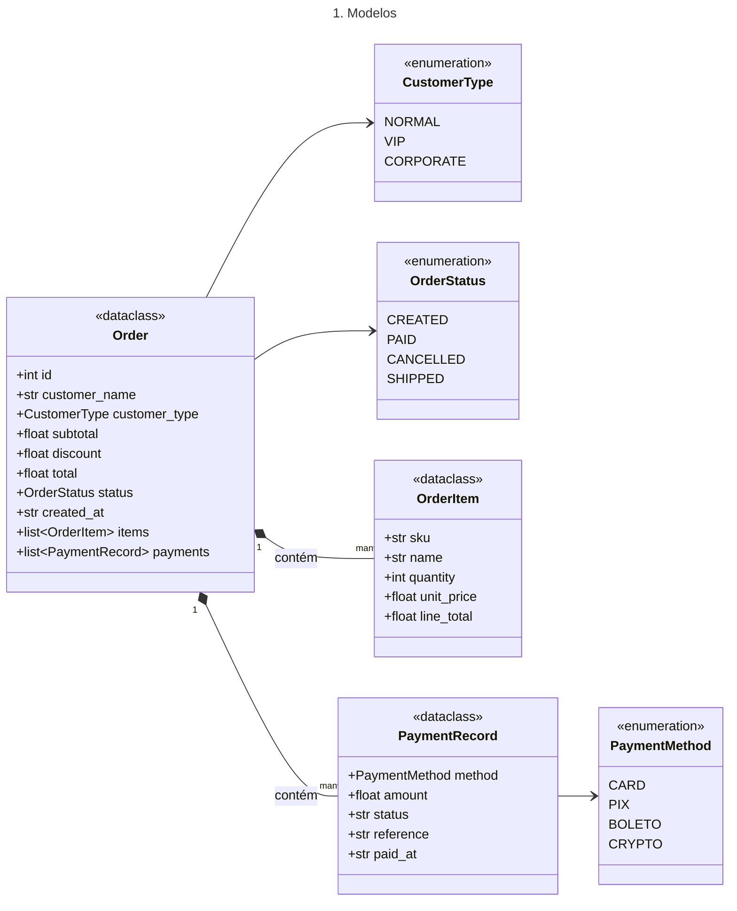

```mermaid
---
title: 1. Modelos
---
classDiagram
    direction LR

    class CustomerType {
        <<enumeration>>
        NORMAL
        VIP
        CORPORATE
    }

    class OrderStatus {
        <<enumeration>>
        CREATED
        PAID
        CANCELLED
        SHIPPED
    }

    class PaymentMethod {
        <<enumeration>>
        CARD
        PIX
        BOLETO
        CRYPTO
    }

    class OrderItem {
        <<dataclass>>
        +str sku
        +str name
        +int quantity
        +float unit_price
        +float line_total
    }

    class PaymentRecord {
        <<dataclass>>
        +PaymentMethod method
        +float amount
        +str status
        +str reference
        +str paid_at
    }

    class Order {
        <<dataclass>>
        +int id
        +str customer_name
        +CustomerType customer_type
        +float subtotal
        +float discount
        +float total
        +OrderStatus status
        +str created_at
        +list~OrderItem~ items
        +list~PaymentRecord~ payments
    }

    Order "1" *-- "many" OrderItem : contém
    Order "1" *-- "many" PaymentRecord : contém
    Order --> CustomerType
    Order --> OrderStatus
    PaymentRecord --> PaymentMethod
```
