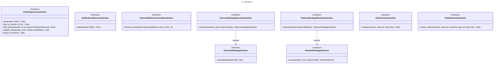

```mermaid
---
title: 2. Interfaces
---
classDiagram
    direction TB

    class OrderRepositoryInterface {
        <<interface>>
        +save(order Order) Order
        +get_by_id(order_id int) Order
        +add_payment(order_id int, payment PaymentRecord) None
        +update_status(order_id int, status OrderStatus) bool
        +report_summary() tuple
    }

    class NotificationObserverInterface {
        <<interface>>
        +update(order Order) None
    }

    class PaymentReferenceProviderInterface {
        <<interface>>
        +reference_for(method PaymentMethod, order_id int) str
    }

    class DiscountStrategyInterface {
        <<interface>>
        +calculate(subtotal float) float
    }

    class DiscountStrategyResolverInterface {
        <<interface>>
        +resolve(customer_type CustomerType) DiscountStrategyInterface
    }

    class PaymentStrategyInterface {
        <<interface>>
        +execute(order_id int, amount float) PaymentRecord
    }

    class PaymentStrategyResolverInterface {
        <<interface>>
        +resolve(method PaymentMethod) PaymentStrategyInterface
    }

    class OrderFactoryInterface {
        <<interface>>
        +create(customer_name str, items list) Order
    }

    class PedidoFactoryInterface {
        <<interface>>
        +create_order(customer_name str, customer_type str, items list) Order
    }

    DiscountStrategyResolverInterface --> DiscountStrategyInterface : retorna
    PaymentStrategyResolverInterface --> PaymentStrategyInterface : retorna
```
