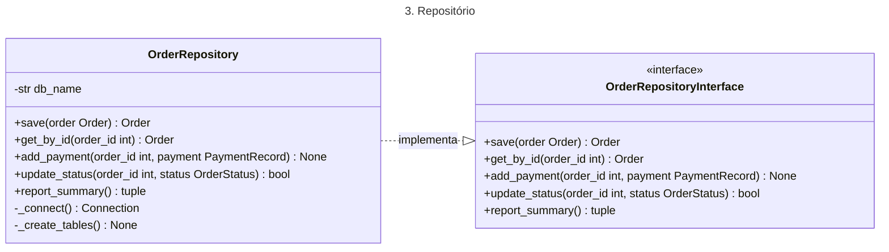

```mermaid
---
title: 3. Repositório
---
classDiagram
    direction LR

    class OrderRepositoryInterface {
        <<interface>>
        +save(order Order) Order
        +get_by_id(order_id int) Order
        +add_payment(order_id int, payment PaymentRecord) None
        +update_status(order_id int, status OrderStatus) bool
        +report_summary() tuple
    }

    class OrderRepository {
        -str db_name
        +save(order Order) Order
        +get_by_id(order_id int) Order
        +add_payment(order_id int, payment PaymentRecord) None
        +update_status(order_id int, status OrderStatus) bool
        +report_summary() tuple
        -_connect() Connection
        -_create_tables() None
    }

    OrderRepository ..|> OrderRepositoryInterface : implementa
```
