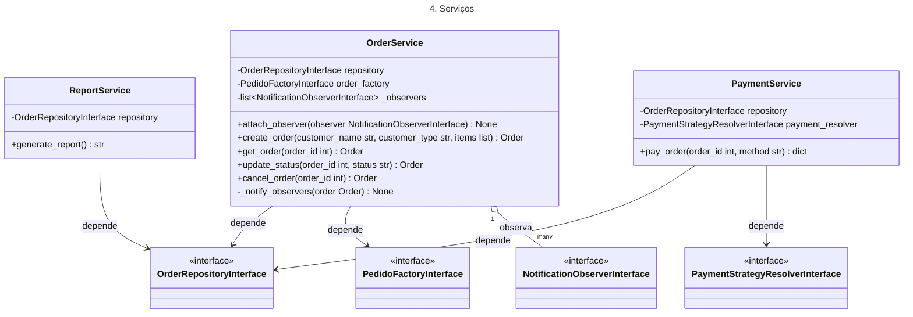

```mermaid
---
title: 4. Serviços
---
classDiagram
    direction TB

    class OrderService {
        -OrderRepositoryInterface repository
        -PedidoFactoryInterface order_factory
        -list~NotificationObserverInterface~ _observers
        +attach_observer(observer NotificationObserverInterface) None
        +create_order(customer_name str, customer_type str, items list) Order
        +get_order(order_id int) Order
        +update_status(order_id int, status str) Order
        +cancel_order(order_id int) Order
        -_notify_observers(order Order) None
    }

    class PaymentService {
        -OrderRepositoryInterface repository
        -PaymentStrategyResolverInterface payment_resolver
        +pay_order(order_id int, method str) dict
    }

    class ReportService {
        -OrderRepositoryInterface repository
        +generate_report() str
    }

    class OrderRepositoryInterface {
        <<interface>>
    }

    class PedidoFactoryInterface {
        <<interface>>
    }

    class NotificationObserverInterface {
        <<interface>>
    }

    class PaymentStrategyResolverInterface {
        <<interface>>
    }

    OrderService --> OrderRepositoryInterface : depende
    OrderService --> PedidoFactoryInterface : depende
    OrderService "1" o-- "many" NotificationObserverInterface : observa
    PaymentService --> OrderRepositoryInterface : depende
    PaymentService --> PaymentStrategyResolverInterface : depende
    ReportService --> OrderRepositoryInterface : depende
```
