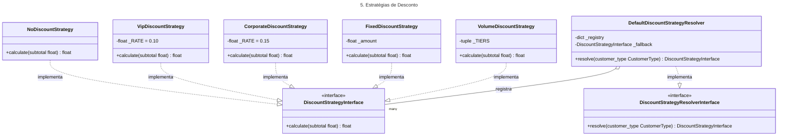

```mermaid
---
title: 5. Estratégias de Desconto
---
classDiagram
    direction TB

    class DiscountStrategyInterface {
        <<interface>>
        +calculate(subtotal float) float
    }

    class DiscountStrategyResolverInterface {
        <<interface>>
        +resolve(customer_type CustomerType) DiscountStrategyInterface
    }

    class NoDiscountStrategy {
        +calculate(subtotal float) float
    }

    class VipDiscountStrategy {
        -float _RATE = 0.10
        +calculate(subtotal float) float
    }

    class CorporateDiscountStrategy {
        -float _RATE = 0.15
        +calculate(subtotal float) float
    }

    class FixedDiscountStrategy {
        -float _amount
        +calculate(subtotal float) float
    }

    class VolumeDiscountStrategy {
        -tuple _TIERS
        +calculate(subtotal float) float
    }

    class DefaultDiscountStrategyResolver {
        -dict _registry
        -DiscountStrategyInterface _fallback
        +resolve(customer_type CustomerType) DiscountStrategyInterface
    }

    NoDiscountStrategy ..|> DiscountStrategyInterface : implementa
    VipDiscountStrategy ..|> DiscountStrategyInterface : implementa
    CorporateDiscountStrategy ..|> DiscountStrategyInterface : implementa
    FixedDiscountStrategy ..|> DiscountStrategyInterface : implementa
    VolumeDiscountStrategy ..|> DiscountStrategyInterface : implementa
    DefaultDiscountStrategyResolver ..|> DiscountStrategyResolverInterface : implementa
    DefaultDiscountStrategyResolver "1" o-- "many" DiscountStrategyInterface : registra
```
