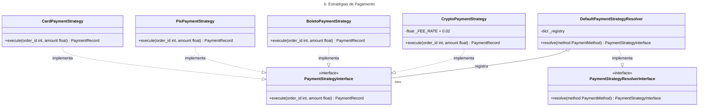

```mermaid
---
title: 6. Estratégias de Pagamento
---
classDiagram
    direction TB

    class PaymentStrategyInterface {
        <<interface>>
        +execute(order_id int, amount float) PaymentRecord
    }

    class PaymentStrategyResolverInterface {
        <<interface>>
        +resolve(method PaymentMethod) PaymentStrategyInterface
    }

    class CardPaymentStrategy {
        +execute(order_id int, amount float) PaymentRecord
    }

    class PixPaymentStrategy {
        +execute(order_id int, amount float) PaymentRecord
    }

    class BoletoPaymentStrategy {
        +execute(order_id int, amount float) PaymentRecord
    }

    class CryptoPaymentStrategy {
        -float _FEE_RATE = 0.02
        +execute(order_id int, amount float) PaymentRecord
    }

    class DefaultPaymentStrategyResolver {
        -dict _registry
        +resolve(method PaymentMethod) PaymentStrategyInterface
    }

    CardPaymentStrategy ..|> PaymentStrategyInterface : implementa
    PixPaymentStrategy ..|> PaymentStrategyInterface : implementa
    BoletoPaymentStrategy ..|> PaymentStrategyInterface : implementa
    CryptoPaymentStrategy ..|> PaymentStrategyInterface : implementa
    DefaultPaymentStrategyResolver ..|> PaymentStrategyResolverInterface : implementa
    DefaultPaymentStrategyResolver "1" o-- "many" PaymentStrategyInterface : registra
```
