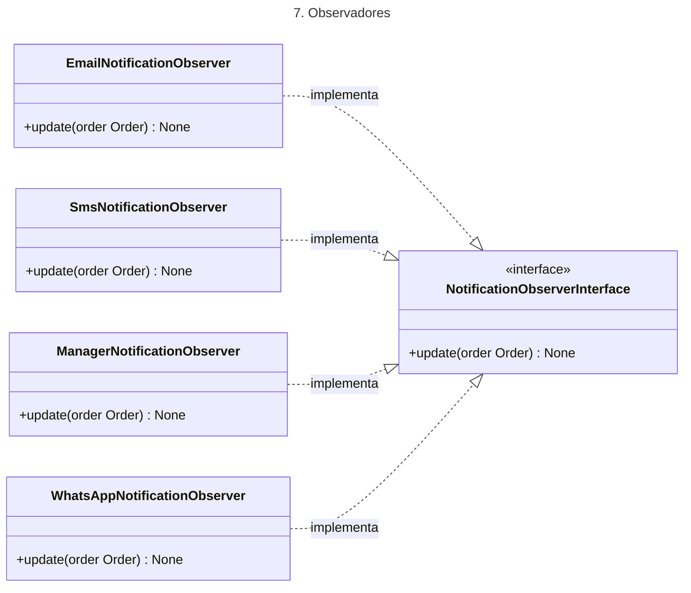

```mermaid
---
title: 7. Observadores
---
classDiagram
    direction LR

    class NotificationObserverInterface {
        <<interface>>
        +update(order Order) None
    }

    class EmailNotificationObserver {
        +update(order Order) None
    }

    class SmsNotificationObserver {
        +update(order Order) None
    }

    class ManagerNotificationObserver {
        +update(order Order) None
    }

    class WhatsAppNotificationObserver {
        +update(order Order) None
    }

    EmailNotificationObserver ..|> NotificationObserverInterface : implementa
    SmsNotificationObserver ..|> NotificationObserverInterface : implementa
    ManagerNotificationObserver ..|> NotificationObserverInterface : implementa
    WhatsAppNotificationObserver ..|> NotificationObserverInterface : implementa
```
