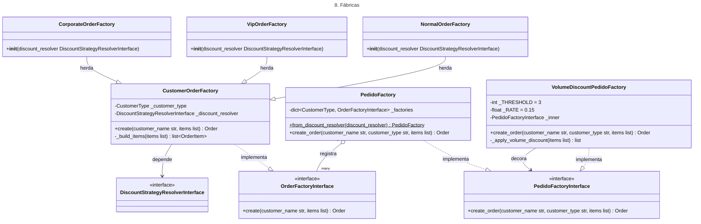

```mermaid
---
title: 8. Fábricas
---
classDiagram
    direction TB

    class OrderFactoryInterface {
        <<interface>>
        +create(customer_name str, items list) Order
    }

    class PedidoFactoryInterface {
        <<interface>>
        +create_order(customer_name str, customer_type str, items list) Order
    }

    class CustomerOrderFactory {
        -CustomerType _customer_type
        -DiscountStrategyResolverInterface _discount_resolver
        +create(customer_name str, items list) Order
        -_build_items(items list) list~OrderItem~
    }

    class NormalOrderFactory {
        +__init__(discount_resolver DiscountStrategyResolverInterface)
    }

    class VipOrderFactory {
        +__init__(discount_resolver DiscountStrategyResolverInterface)
    }

    class CorporateOrderFactory {
        +__init__(discount_resolver DiscountStrategyResolverInterface)
    }

    class PedidoFactory {
        -dict~CustomerType, OrderFactoryInterface~ _factories
        +from_discount_resolver(discount_resolver)$ PedidoFactory
        +create_order(customer_name str, customer_type str, items list) Order
    }

    class VolumeDiscountPedidoFactory {
        -int _THRESHOLD = 3
        -float _RATE = 0.15
        -PedidoFactoryInterface _inner
        +create_order(customer_name str, customer_type str, items list) Order
        -_apply_volume_discount(items list) list
    }

    class DiscountStrategyResolverInterface {
        <<interface>>
    }

    NormalOrderFactory --|> CustomerOrderFactory : herda
    VipOrderFactory --|> CustomerOrderFactory : herda
    CorporateOrderFactory --|> CustomerOrderFactory : herda
    CustomerOrderFactory ..|> OrderFactoryInterface : implementa
    CustomerOrderFactory --> DiscountStrategyResolverInterface : depende
    PedidoFactory ..|> PedidoFactoryInterface : implementa
    PedidoFactory "1" o-- "many" OrderFactoryInterface : registra
    VolumeDiscountPedidoFactory ..|> PedidoFactoryInterface : implementa
    VolumeDiscountPedidoFactory --> PedidoFactoryInterface : decora
```
