# Relatório Final — EFC1
# Padrões e Arquitetura de Software

**Repositório:** github.com/brunoccruzz/Padroes-Arquitetura-de-Software

Este relatório documenta a refatoração do sistema de pedidos originalmente concentrado em
`legacy_system.py`. A versão final utiliza camadas explícitas, abstrações, Strategy, Factory,
Observer e Decorator, mantendo a fachada `LegacyOrderSystem` para compatibilidade com os
Golden Master Tests.

---

## 1. Visão Geral da Arquitetura Final

| Camada/arquivo | Responsabilidade |
|---|---|
| `legacy_system.py` | Fachada de compatibilidade com a API original; ponto de composição de dependências. |
| `src/models` | Entidades de domínio: `Order`, `OrderItem`, `PaymentRecord` e enums. |
| `src/repositories` | `OrderRepository`, único ponto de acesso direto ao SQLite. |
| `src/services` | Orquestra regras de pedido, pagamento e relatório. |
| `src/interfaces` | Contratos ABC para repositório, observadores e serviços externos. |
| `src/strategies` | Estratégias de desconto e pagamento (Strategy). |
| `src/factories` | Fábricas de pedidos por tipo de cliente e decorator de volume. |
| `src/observers` | Observadores de notificação desacoplados do serviço de pedido. |

---

## (a) Identificação das Violações SOLID

Para cada princípio são identificadas duas violações no código legado (`legacy_system.py`
antes da refatoração — código original disponível no enunciado e em `docs/analise_inicial.md`).

### SRP — Single Responsibility Principle

**Violação 1 — Classe com múltiplas responsabilidades**

Trecho (`legacy_system.py`, classe `LegacyOrderSystem` / `class Sis`):
```python
class Sis:
    def __init__(self):
        self.db = sqlite3.connect('loja.db')   # persistência
    def add_ped(self, n, its, t):              # cria pedido + calcula total + notifica
    def proc_pag(self, id, m, vl):            # processa pagamento
    def gerar_rel(self, tipo):                 # gera relatório
    def cancelar_pedido(self, id):             # cancela pedido
```
**Justificativa:** Uma única classe centralizava criação de tabelas, cálculo de totais,
aplicação de descontos, processamento de pagamentos, alteração de status e geração de
relatórios. Cada uma dessas responsabilidades tem motivos distintos para mudar.
**Impacto prático:** Qualquer alteração em pagamento ou relatório exigia modificar o mesmo
arquivo que continha criação de pedidos e persistência, aumentando o risco de regressão.

**Violação 2 — Método com múltiplas responsabilidades**

Trecho (`legacy_system.py`, método `add_ped`):
```python
def add_ped(self, n, its, t):
    tot = 0
    for i in its:                          # 1. calcula subtotal por tipo de item
        if i['tipo'] == 'normal': ...
    if t == 'vip': tot = tot * 0.95        # 2. aplica desconto por cliente
    self.c.execute("INSERT INTO ped ...")   # 3. persiste no banco
    if t == 'normal': print("Email ...")   # 4. envia notificação
```
**Justificativa:** O método misturava normalização de entrada, cálculo de subtotal, aplicação
de desconto, INSERT em SQLite e disparo de notificações.
**Impacto prático:** Testar apenas o cálculo de desconto exigia banco real; trocar a regra
de negócio afetava o SQL.

---

### OCP — Open/Closed Principle

**Violação 1 — Condicional fechada para extensão (descontos)**

Trecho (`legacy_system.py`, cálculo de desconto):
```python
if t == 'vip':
    tot = tot * 0.95
elif t == 'corporativo':
    tot = tot * 0.90
```
**Justificativa:** Para adicionar um novo tipo de cliente era obrigatório editar o método
central que já calculava e persistia pedidos.
**Impacto prático:** Adicionar `PARTNER`, `BLACK` ou desconto por volume exigia modificar
código já testado e em produção.

**Violação 2 — Condicional fechada para extensão (pagamentos)**

Trecho (`legacy_system.py`, método `proc_pag`):
```python
if m == 'cartao':
    self.upd_st(id, 'aprovado')
elif m == 'pix':
    self.upd_st(id, 'aprovado')
elif m == 'boleto':
    return True
else:
    print("Metodo de pagamento invalido!")
    return False
```
**Justificativa:** Os meios de pagamento estavam fixos em condicionais. Adicionar
criptomoeda exigiria editar este método.
**Impacto prático:** Qualquer novo gateway de pagamento resultava em modificação direta de
código testado, violando OCP.

---

### LSP — Liskov Substitution Principle

**Violação 1 — Repositório não substituível**

Trecho (`legacy_system.py`, método `_connect` / `__init__`):
```python
class Sis:
    def __init__(self):
        self.db = sqlite3.connect('loja.db')  # concreto não substituível
```
**Justificativa:** Não havia contrato substituível para repositório; a lógica de negócio
dependia diretamente de `sqlite3`.
**Impacto prático:** Trocar SQLite por banco em memória ou outro mecanismo exigiria
alterar a regra de negócio.

**Violação 2 — Hierarquia `PedEspecial` quebra contrato do pai**

Trecho (`legacy_system.py`, classe `PedEspecial`):
```python
class PedEspecial(Sis):
    def upd_st(self, id, s):
        # PedEspecial pula direto para qualquer estado
        # ignorando transicoes intermediarias do pai
        self.c.execute("UPDATE ped SET st=? WHERE id=?", (s, id))
```
**Justificativa:** `PedEspecial.upd_st` ignora validações de estado presentes no pai.
Código que recebe um `Sis` e chama `upd_st` tem comportamento diferente ao receber um
`PedEspecial` — viola LSP.
**Impacto prático:** Substituir `Sis` por `PedEspecial` produz comportamento inconsistente
em transições de estado já testadas.

---

### ISP — Interface Segregation Principle

**Violação 1 — Interface pública ampla demais**

Trecho (`legacy_system.py`, interface pública de `Sis`):
```python
class Sis:
    def add_ped(self, n, its, t): ...
    def proc_pag(self, id, m, vl): ...
    def upd_st(self, id, s): ...
    def cancelar_pedido(self, id): ...
    def gerar_rel(self, tipo): ...
```
**Justificativa:** Um consumidor que apenas cria pedidos precisava depender do mesmo objeto
que processa pagamentos, cancela e gera relatórios.
**Impacto prático:** Clientes simples carregavam capacidades que não usam, aumentando
acoplamento desnecessário.

**Violação 2 — Leitura e escrita no mesmo contrato**

Trecho (`legacy_system.py`, métodos `upd_st`, `cancelar_pedido`, `gerar_rel`):
**Justificativa:** Operações de leitura/relatório e comandos de escrita estavam no mesmo
objeto público.
**Impacto prático:** Código apenas consultivo recebia acesso acidental para alterar estado.

---

### DIP — Dependency Inversion Principle

**Violação 1 — Camada de alto nível depende de detalhe técnico**

Trecho (`legacy_system.py`, linha 1):
```python
import sqlite3
```
**Justificativa:** A camada de negócio importava diretamente o módulo de persistência
concreta.
**Impacto prático:** Testes e evolução ficavam presos a SQLite; não era possível injetar
um repositório em memória.

**Violação 2 — Dependência instanciada internamente**

Trecho (`legacy_system.py`, `__init__`):
```python
self.db = sqlite3.connect('loja.db')   # dependência criada dentro da regra
```
**Justificativa:** A dependência era criada internamente, impedindo injeção de fake ou
repositório alternativo.
**Impacto prático:** Criar teste unitário isolado ou migrar banco exigiria editar a classe.

---

## (b) Soluções Implementadas

### Padrões GoF Aplicados

Para cada padrão: nome, **intenção segundo GoF**, classes/interfaces criadas,
justificativa e trecho antes/depois.

---

#### Strategy — Descontos e Pagamentos

**Intenção GoF:** *"Define uma família de algoritmos, encapsula cada um deles e os torna
intercambiáveis. Strategy permite que o algoritmo varie independentemente dos clientes que
o utilizam."* (Gamma et al., 1994, p. 315)

**Classes e interfaces criadas:**
- `DiscountStrategyInterface` (ABC) — contrato `calculate(subtotal) -> float`
- `DiscountStrategyResolverInterface` (ABC) — contrato `resolve(customer_type)`
- `NoDiscountStrategy`, `VipDiscountStrategy`, `CorporateDiscountStrategy`,
  `FixedDiscountStrategy`, `VolumeDiscountStrategy`
- `PaymentStrategyInterface` (ABC) — contrato `execute(order_id, amount) -> PaymentRecord`
- `PaymentStrategyResolverInterface` (ABC) — contrato `resolve(method)`
- `CardPaymentStrategy`, `PixPaymentStrategy`, `BoletoPaymentStrategy`,
  `CryptoPaymentStrategy`
- `DefaultDiscountStrategyResolver`, `DefaultPaymentStrategyResolver`

**Antes (OCP 1 — desconto):**
```python
if normalized_type == "VIP":
    discount_rate = 0.10
elif normalized_type == "CORPORATE":
    discount_rate = 0.15
```

**Depois:**
```python
class DiscountStrategyInterface(ABC):
    def calculate(self, subtotal: float) -> float: ...

class VipDiscountStrategy(DiscountStrategyInterface):
    def calculate(self, subtotal: float) -> float:
        return round(subtotal * 0.10, 2)
```
Uso: `discount_resolver.resolve(customer_type).calculate(subtotal)`

**Antes (OCP 2 — pagamento):**
```python
reference_prefix = {"CARD": "CARD", "PIX": "PIX", "BOLETO": "BOL"}[normalized_method]
```

**Depois:**
```python
payment = self.payment_resolver.resolve(payment_method).execute(order_id, order.total)
self.repository.add_payment(order_id, payment)
```

**Justificativa:** Com Strategy, adicionar criptomoeda ou novo desconto requer apenas uma
nova classe sem modificar código existente — OCP em prática.

---

#### Repository — Isolamento de Persistência

**Intenção GoF/POEAA:** *"Medeia entre o domínio e as camadas de mapeamento de dados
usando uma interface do tipo coleção para acessar objetos de domínio."*
(Fowler, 2002 — Patterns of Enterprise Application Architecture)

**Classes e interfaces criadas:**
- `OrderRepositoryInterface` (ABC) — contratos `save`, `get_by_id`, `add_payment`,
  `update_status`, `report_summary`
- `OrderRepository` — implementação concreta com SQLite

**Antes (DIP 1):**
```python
import sqlite3
class Sis:
    def __init__(self):
        self.db = sqlite3.connect('loja.db')
```

**Depois (DIP 1 e 2):**
```python
class PaymentService:
    def __init__(
        self,
        repository: OrderRepositoryInterface,          # abstração
        payment_resolver: PaymentStrategyResolverInterface,
    ) -> None:
        self.repository = repository
        self.payment_resolver = payment_resolver
```

**Justificativa:** Serviços dependem de `OrderRepositoryInterface`; trocar SQLite por banco
em memória para testes é trivial. A composição concreta fica na fachada `LegacyOrderSystem`
(borda do sistema).

---

#### Observer — Notificações Desacopladas

**Intenção GoF:** *"Define uma dependência um-para-muitos entre objetos de forma que,
quando um objeto muda de estado, todos os seus dependentes são notificados e atualizados
automaticamente."* (Gamma et al., 1994, p. 293)

**Classes e interfaces criadas:**
- `NotificationObserverInterface` (ABC) — contrato `update(order: Order)`
- `EmailNotificationObserver` — notifica todos os clientes
- `SmsNotificationObserver` — notifica clientes VIP
- `ManagerNotificationObserver` — notifica gerente de conta em pedidos CORPORATE
- `WhatsAppNotificationObserver` — notifica todos (Extensão 2)
- `OrderService` como *subject*: `attach_observer()`, `_notify_observers()`

**Antes (ISP 1):**
```python
if t == 'normal':
    print(f"Email enviado para {n}: Pedido recebido!")
elif t == 'vip':
    print(f"Email enviado para {n}: Pedido recebido!")
    print(f"SMS enviado para {n}: Pedido VIP recebido!")
elif t == 'corporativo':
    print(f"Email enviado para {n}: Pedido recebido!")
    print(f"Notificacao enviada ao gerente de conta de {n}")
```

**Depois:**
```python
class WhatsAppNotificationObserver(NotificationObserverInterface):
    def update(self, order: Order) -> None:
        pass  # integração com WhatsApp
```
Uso: `self.order_service.attach_observer(WhatsAppNotificationObserver())`

**Justificativa:** `OrderService` notifica uma lista polimórfica de observadores. Adicionar
um novo canal (WhatsApp, Push) requer apenas uma nova classe — nenhuma modificação em
`OrderService`.

---

#### Factory Method / Abstract Factory — Criação de Pedidos

**Intenção GoF:** *"Define uma interface para criar um objeto, mas deixa as subclasses
decidirem qual classe instanciar. Factory Method permite a uma classe deferir a
instanciação para subclasses."* (Gamma et al., 1994, p. 107)

**Classes e interfaces criadas:**
- `OrderFactoryInterface` (ABC) — contrato `create(customer_name, items) -> Order`
- `PedidoFactoryInterface` (ABC) — contrato `create_order(name, type, items) -> Order`
- `NormalOrderFactory`, `VipOrderFactory`, `CorporateOrderFactory` (subclasses de
  `CustomerOrderFactory`)
- `PedidoFactory` — router que seleciona a factory concreta pelo tipo de cliente

**Antes (SRP 2):**
```python
def add_ped(self, n, its, t):
    tot = 0
    for i in its:
        ...  # cálculo inline, misturado com INSERT
    self.c.execute("INSERT INTO ped ...")
```

**Depois:**
```python
class NormalOrderFactory(CustomerOrderFactory):
    def __init__(self, discount_resolver: DiscountStrategyResolverInterface):
        super().__init__(CustomerType.NORMAL, discount_resolver)
```
Uso: `order = self.order_factory.create_order(customer_name, customer_type, items)`

**Justificativa:** Cada tipo de cliente tem sua própria factory, que sabe como calcular
subtotal e aplicar desconto. `OrderService` não conhece as diferenças entre clientes.

---

#### Decorator — Desconto por Volume (Extensão 3)

**Intenção GoF:** *"Acopla responsabilidades adicionais a um objeto dinamicamente.
Decorators oferecem uma alternativa flexível à herança para estender funcionalidades."*
(Gamma et al., 1994, p. 175)

**Classes criadas:**
- `VolumeDiscountPedidoFactory` — implementa `PedidoFactoryInterface` e encapsula
  outro `PedidoFactoryInterface`, aplicando 15% de desconto em itens com `quantity >= 3`
  antes de delegar.

**Antes:** sem suporte a desconto por volume.

**Depois:**
```python
class VolumeDiscountPedidoFactory(PedidoFactoryInterface):
    _THRESHOLD: int = 3
    _RATE: float = 0.15

    def __init__(self, inner: PedidoFactoryInterface) -> None:
        self._inner = inner

    def create_order(self, customer_name: str, customer_type: str, items: OrderItemsInput) -> Order:
        adjusted = self._apply_volume_discount(items)
        return self._inner.create_order(customer_name, customer_type, adjusted)

    def _apply_volume_discount(self, items: OrderItemsInput) -> list[dict[str, object]]:
        # reduz unit_price em 15% para itens com quantity >= 3
        ...
```
Uso em `legacy_system.py`:
```python
self.order_service = OrderService(
    repository,
    VolumeDiscountPedidoFactory(PedidoFactory.from_discount_resolver(discount_resolver)),
)
```

**Justificativa:** Nenhuma classe existente foi modificada; `PedidoFactory` e
`OrderService` são completamente alheios à regra de volume.

---

### Tabela resumida das soluções

| Violação | Solução adotada | Padrão GoF | Classes/interfaces |
|---|---|---|---|
| SRP 1 | Separação em `OrderService`, `PaymentService`, `ReportService`, `OrderRepository` | Service Layer + Repository | as 4 classes listadas |
| SRP 2 | Persistência isolada em `OrderRepository`; `create_order` só orquestra | Repository | `OrderRepositoryInterface`, `OrderRepository` |
| OCP 1 | Descontos extraídos para `DiscountStrategyInterface` + resolver | Strategy | `NoDiscount`, `VipDiscount`, `CorporateDiscount`, `FixedDiscount` |
| OCP 2 | Pagamentos extraídos para `PaymentStrategyInterface` + resolver | Strategy | `Card`, `Pix`, `Boleto`, `CryptoPaymentStrategy` |
| LSP 1 | Serviços dependem de `OrderRepositoryInterface` | Repository + DIP | `OrderRepositoryInterface` |
| LSP 2 | `PedEspecial` eliminada; pagamentos implementam contrato `execute()` | Strategy | `PaymentStrategyInterface` |
| ISP 1 | Contratos separados: repositório, observador, resolvedores | Interface Segregation | `OrderRepositoryInterface`, `NotificationObserverInterface` |
| ISP 2 | `ReportService` depende apenas de `report_summary` | Service + Repository | `ReportService` |
| DIP 1 | Serviços dependem de abstrações, não de SQLite | Dependency Injection | `OrderService`, `PaymentService`, `ReportService` |
| DIP 2 | Composição concreta na fachada `LegacyOrderSystem` | Facade + DI | `LegacyOrderSystem` |

---

## (c) Diagrama UML de Classes

```mermaid
classDiagram
    direction TB

    class LegacyOrderSystem
    class OrderService
    class PaymentService
    class ReportService

    class OrderRepositoryInterface
    class OrderRepository

    class PedidoFactoryInterface
    class PedidoFactory
    class OrderFactoryInterface
    class CustomerOrderFactory
    class VolumeDiscountPedidoFactory

    class DiscountStrategyInterface
    class DiscountStrategyResolverInterface
    class DefaultDiscountStrategyResolver

    class PaymentStrategyInterface
    class PaymentStrategyResolverInterface
    class DefaultPaymentStrategyResolver

    class NotificationObserverInterface
    class EmailNotificationObserver
    class SmsNotificationObserver
    class ManagerNotificationObserver
    class WhatsAppNotificationObserver

    class CryptoPaymentStrategy

    class Order
    class OrderItem
    class PaymentRecord

    LegacyOrderSystem --> OrderService : usa
    LegacyOrderSystem --> PaymentService : usa
    LegacyOrderSystem --> ReportService : usa

    OrderService --> OrderRepositoryInterface : depende
    OrderService --> PedidoFactoryInterface : depende
    OrderService --> NotificationObserverInterface : notifica

    PaymentService --> OrderRepositoryInterface : depende
    PaymentService --> PaymentStrategyResolverInterface : depende

    ReportService --> OrderRepositoryInterface : depende

    OrderRepository ..|> OrderRepositoryInterface

    VolumeDiscountPedidoFactory ..|> PedidoFactoryInterface
    VolumeDiscountPedidoFactory --> PedidoFactoryInterface : decora

    PedidoFactory ..|> PedidoFactoryInterface
    CustomerOrderFactory ..|> OrderFactoryInterface

    DefaultDiscountStrategyResolver ..|> DiscountStrategyResolverInterface
    DefaultDiscountStrategyResolver --> DiscountStrategyInterface : resolve para

    DefaultPaymentStrategyResolver ..|> PaymentStrategyResolverInterface
    DefaultPaymentStrategyResolver --> PaymentStrategyInterface : resolve para

    CryptoPaymentStrategy ..|> PaymentStrategyInterface

    EmailNotificationObserver ..|> NotificationObserverInterface
    SmsNotificationObserver ..|> NotificationObserverInterface
    ManagerNotificationObserver ..|> NotificationObserverInterface
    WhatsAppNotificationObserver ..|> NotificationObserverInterface

    Order *-- OrderItem
    Order *-- PaymentRecord
```



---

## (d) Melhorias de Clean Code

**Nomenclatura:** `create_order`, `pay_order`, `report_summary`, `PaymentStrategyInterface`,
`DiscountStrategyInterface` expressam intenção sem abreviações. Substituímos nomes como
`add_ped`, `proc_pag`, `upd_st`, `gerar_rel` e `Sis` por nomes autoexplicativos.

**Métodos extraídos:** `_notify_observers`, `_build_items`, `_required_scalar` em
`CustomerOrderFactory`, `_apply_volume_discount` em `VolumeDiscountPedidoFactory`, e todos
os métodos do `OrderRepository` reduziram a complexidade dos métodos longos do legado.

**Abstrações criadas:** Interfaces ABC para repositório (`OrderRepositoryInterface`),
observadores (`NotificationObserverInterface`), fábricas (`PedidoFactoryInterface`,
`OrderFactoryInterface`) e estratégias (`DiscountStrategyInterface`,
`PaymentStrategyInterface`, e seus resolvers).

**Duplicação eliminada:** O cálculo de desconto e a geração de pagamento saíram de
condicionais duplicáveis para classes especializadas. Antes, a lógica de desconto aparecia
tanto em `add_ped` quanto em `PedEspecial.add_ped`.

**Coesão:** Cada classe possui um único motivo de mudança — pedido, pagamento, relatório,
persistência, notificação, desconto ou criação de pedido.

**Testabilidade:** Serviços aceitam dependências por construtor, permitindo mocks/fakes
sem SQLite em nenhum teste unitário.

---

## (e) Extensões Implementadas

Cada extensão foi implementada em commits separados, adicionando apenas novas classes.
Os Golden Master Tests originais continuam passando.

---

### Extensão 1 — Pagamento em Criptomoeda

**Arquivos adicionados:** `src/strategies/crypto_payment_strategy.py`

**Arquivo modificado (ponto de composição):** `legacy_system.py` — registro no resolver.

```python
# src/strategies/crypto_payment_strategy.py  (novo arquivo)
class CryptoPaymentStrategy(PaymentStrategyInterface):
    _FEE_RATE: float = 0.02

    def execute(self, order_id: int, amount: float) -> PaymentRecord:
        amount_with_fee = round(amount * (1.0 + self._FEE_RATE), 2)
        return PaymentRecord(
            method=PaymentMethod.CRYPTO,
            amount=amount_with_fee,
            status="APPROVED",
            reference=f"CRYPTO-{order_id:06d}",
            paid_at=datetime.now().strftime("%Y-%m-%d %H:%M:%S"),
        )
```

Registro no ponto de composição (`legacy_system.py`):
```python
payment_resolver = DefaultPaymentStrategyResolver(
    registry={
        PaymentMethod.CARD: CardPaymentStrategy(),
        PaymentMethod.PIX: PixPaymentStrategy(),
        PaymentMethod.BOLETO: BoletoPaymentStrategy(),
        PaymentMethod.CRYPTO: CryptoPaymentStrategy(),   # extensão
    },
)
```

**Justificativa:** Como pagamento é resolvido por `PaymentStrategyInterface`, o fluxo de
`PaymentService.pay_order` não muda. Adicionar CRYPTO exigiu apenas uma nova classe e um
registro no resolver — OCP empiricamente demonstrado.

---

### Extensão 2 — Notificação por WhatsApp

**Arquivo adicionado:** `src/observers/whatsapp_observer.py`

**Arquivo modificado (ponto de composição):** `legacy_system.py` — registro do observer.

```python
# src/observers/whatsapp_observer.py  (novo arquivo)
class WhatsAppNotificationObserver(NotificationObserverInterface):
    def update(self, order: Order) -> None:
        pass  # integração real com API do WhatsApp
```

Registro no ponto de composição (`legacy_system.py`):
```python
self.order_service.attach_observer(WhatsAppNotificationObserver())
```

**Justificativa:** Como `OrderService` notifica uma lista polimórfica de observadores,
a extensão entrou apenas como novo observador. Nenhuma regra de pedido precisou ser
reescrita — padrão Observer em prática.

---

### Extensão 3 — Desconto Progressivo por Volume

**Arquivo adicionado:** `src/factories/volume_discount_factory.py`

**Arquivo modificado (ponto de composição):** `legacy_system.py` — wrapping da factory.

Regra: **3 ou mais unidades do mesmo item → 15% de desconto adicional no `unit_price`**.

```python
# src/factories/volume_discount_factory.py  (novo arquivo)
class VolumeDiscountPedidoFactory(PedidoFactoryInterface):
    """Decorator: aplica 15% de desconto em itens com quantity >= 3."""
    _THRESHOLD: int = 3
    _RATE: float = 0.15

    def __init__(self, inner: PedidoFactoryInterface) -> None:
        self._inner = inner

    def create_order(self, customer_name: str, customer_type: str, items: OrderItemsInput) -> Order:
        adjusted = self._apply_volume_discount(items)
        return self._inner.create_order(customer_name, customer_type, adjusted)

    def _apply_volume_discount(self, items: OrderItemsInput) -> list[dict[str, object]]:
        result: list[dict[str, object]] = []
        for item in items:
            quantity = self._to_int(item, "quantity")
            if quantity >= self._THRESHOLD:
                unit_price = self._to_float(item, "unit_price")
                adjusted: dict[str, object] = dict(item)
                adjusted["unit_price"] = round(unit_price * (1.0 - self._RATE), 2)
                result.append(adjusted)
            else:
                result.append(dict(item))
        return result
```

Registro no ponto de composição (`legacy_system.py`):
```python
self.order_service = OrderService(
    repository,
    VolumeDiscountPedidoFactory(              # Decorator envolve a factory existente
        PedidoFactory.from_discount_resolver(discount_resolver)
    ),
)
```

**Justificativa:** Padrão **Decorator** sobre `PedidoFactoryInterface`. `PedidoFactory`,
`OrderService` e todos os serviços existentes são completamente alheios à regra de volume.
Nenhuma classe existente foi modificada.

---

## (f) Reflexão Metacognitiva

### O princípio que ainda não dominei

O princípio que ainda apresenta mais dificuldade é o **LSP**. A ideia geral de que uma
implementação deve poder substituir outra sem quebrar o cliente é clara, mas na prática
ainda confundo LSP com DIP quando trabalho com interfaces.

Neste projeto ficou mais claro que não basta criar uma interface: as implementações
precisam obedecer ao mesmo comportamento esperado — pré-condições não mais restritivas,
pós-condições não menos garantidas. Por exemplo, uma `PaymentStrategy` não pode retornar
um objeto incompatível ou exigir parâmetros extras, mesmo implementando a classe abstrata.
A classe `PedEspecial` do legado era o exemplo mais direto: herdava de `Sis`, mas violava
as transições de estado do pai, quebrando qualquer cliente que assumia o contrato original.

### Como usei IA neste trabalho

Usei IA para revisar as violações SOLID, sugerir uma separação inicial em camadas e
garantir que todos os critérios de aceitação do projeto fossem mapeados na documentação.
Os prompts que funcionaram melhor foram específicos, como *"identifique duas violações por
princípio no legacy_system.py"* e *"proponha refatoração mantendo Golden Master Tests"*.
Prompts genéricos, como *"melhore o código"*, falharam porque sugeriam mudanças grandes sem
preservar compatibilidade.

Uma decisão em que discordei da IA foi evitar transformar tudo em várias microinterfaces
pequenas demais. A IA sugeriu criar interfaces separadas para cada operação do repositório
(ex.: `SaveOrderInterface`, `FindOrderInterface`). Mantive interfaces por papel
arquitetural para não deixar o projeto artificialmente complexo e dificultar a leitura.

---

## 7. Saída dos Testes e Métricas

### 7.1 Testes — pytest -v

```
platform win32 -- Python 3.11.9, pytest-9.0.3
collected 74 items

tests/golden_master/test_legacy_behavior.py::test_create_normal_order PASSED
tests/golden_master/test_legacy_behavior.py::test_create_vip_order PASSED
tests/golden_master/test_legacy_behavior.py::test_create_corporate_order PASSED
tests/golden_master/test_legacy_behavior.py::test_payment_methods[card-CARD-000001] PASSED
tests/golden_master/test_legacy_behavior.py::test_payment_methods[pix-PIX-000001] PASSED
tests/golden_master/test_legacy_behavior.py::test_payment_methods[boleto-BOL-000001] PASSED
tests/golden_master/test_legacy_behavior.py::test_update_status PASSED
tests/golden_master/test_legacy_behavior.py::test_cancel_order PASSED
tests/golden_master/test_legacy_behavior.py::test_report_generation PASSED
tests/golden_master/test_legacy_behavior.py::test_paid_order_cannot_be_cancelled PASSED
tests/unit/test_crypto_payment_strategy.py (17 testes) ... todos PASSED
tests/unit/test_notification_observers.py (8 testes) ... todos PASSED
tests/unit/test_pedido_factory.py (7 testes) ... todos PASSED
tests/unit/test_volume_discount_factory.py (11 testes) ... todos PASSED
tests/unit/test_volume_discount_strategy.py (21 testes) ... todos PASSED

74 passed in 1.42s
```

### 7.2 Cobertura — pytest --cov

```
Name                                    Stmts  Miss  Branch  BrPart  Cover
--------------------------------------------------------------------------
legacy_system.py                           41     1       2       1    95%
src/factories/order_factory.py             56     3       4       1    93%
src/factories/volume_discount_factory.py   37     0      12       0   100%
src/models/order.py                        42     0       0       0   100%
src/observers/email_observer.py             5     0       0       0   100%
src/observers/manager_observer.py           6     0       2       0   100%
src/observers/sms_observer.py               6     0       2       0   100%
src/observers/whatsapp_observer.py          5     0       0       0   100%
src/repositories/order_repository.py      73     4       8       3    91%
src/services/order_service.py              38     4      12       4    84%
src/services/payment_service.py            18     2       4       2    82%
src/services/report_service.py              9     0       0       0   100%
src/strategies/crypto_payment_strategy.py   8     0       0       0   100%
src/strategies/discount_strategy.py        32     4       0       0    88%
src/strategies/payment_strategy.py         28     3       2       1    87%
src/strategies/volume_discount_strategy.py  8     0       4       0   100%
--------------------------------------------------------------------------
TOTAL                                     755    33      52      12    94%
Required test coverage of 80.0% reached. Total coverage: 94.42%
```

### 7.3 Lint — ruff check

```
$ ruff check .
All checks passed!
```

### 7.4 Type hints — mypy --strict

```
$ mypy --strict src/
Success: no issues found in 26 source files
```

### 7.5 Complexidade Ciclomática — radon cc

```
$ radon cc src/ -s -a

src/factories/order_factory.py
    C CustomerOrderFactory - A (3)
    M CustomerOrderFactory.create - A (2)
    M CustomerOrderFactory._build_items - A (2)
    ...
src/factories/volume_discount_factory.py
    C VolumeDiscountPedidoFactory - A (3)
    M _apply_volume_discount - A (3)
    M _to_int - A (3)
    M _to_float - A (3)
src/repositories/order_repository.py
    M OrderRepository.save - A (4)
    M OrderRepository.get_by_id - A (4)
    ...
src/strategies/volume_discount_strategy.py
    C VolumeDiscountStrategy - A (4)
    M VolumeDiscountStrategy.calculate - A (3)
src/services/order_service.py
    M OrderService.update_status - A (3)
    M OrderService.cancel_order - A (3)
    ...

105 blocks (classes, functions, methods) analyzed.
Average complexity: A (1.73)
```

Todos os 105 blocos receberam nota **A** (CC ≤ 4), bem abaixo do limite B (CC ≤ 10) exigido.

---

## 8. Referências

1. MARTIN, R. C. *Clean Code: A Handbook of Agile Software Craftsmanship*. Prentice Hall,
   2008. Capítulos 2, 3, 6, 10.

2. FEATHERS, M. *Working Effectively with Legacy Code*. Prentice Hall, 2004. Capítulos 13
   (Golden Master) e 22.

3. GAMMA, E.; HELM, R.; JOHNSON, R.; VLISSIDES, J. *Design Patterns: Elements of Reusable
   Object-Oriented Software*. Addison-Wesley, 1994. (Strategy, p. 315; Observer, p. 293;
   Factory Method, p. 107; Decorator, p. 175.)

4. FOWLER, M. *Refactoring: Improving the Design of Existing Code*. 2. ed. Addison-Wesley,
   2018.

5. FOWLER, M. *Patterns of Enterprise Application Architecture*. Addison-Wesley, 2002.
   (Repository Pattern.)

6. NORTH, D. CUPID for joyful coding. Disponível em: https://dannorth.net/cupid-for-joyful-coding/

---

*Referências do próprio projeto:*

- `README.md` — descrição de arquitetura, comandos e sprints.
- `docs/analise_inicial.md` — violações SOLID originais identificadas no Sprint 0.
- `docs/diagram.md` — diagrama de classes em Mermaid (versão original Sprint 1).
- `pyproject.toml` — configuração de pytest, coverage, mypy e ruff.
- `src/services`, `src/repositories`, `src/strategies`, `src/factories`, `src/observers` — código refatorado.
